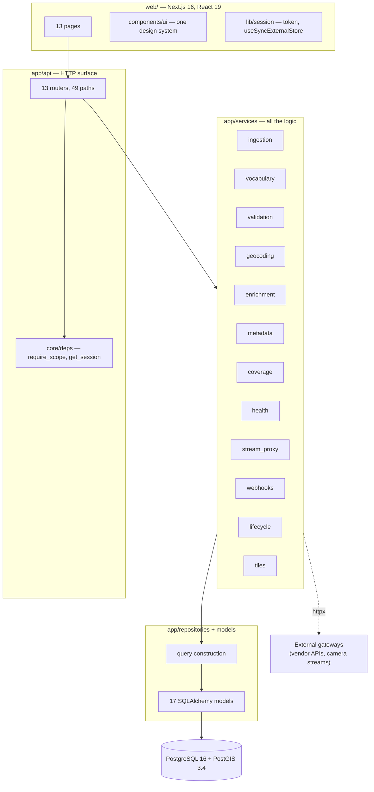
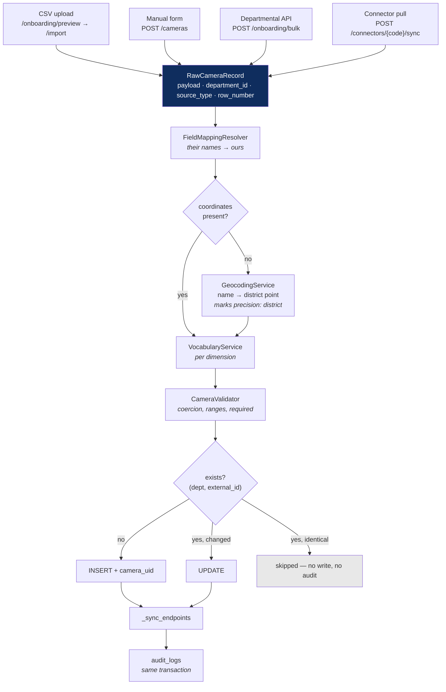
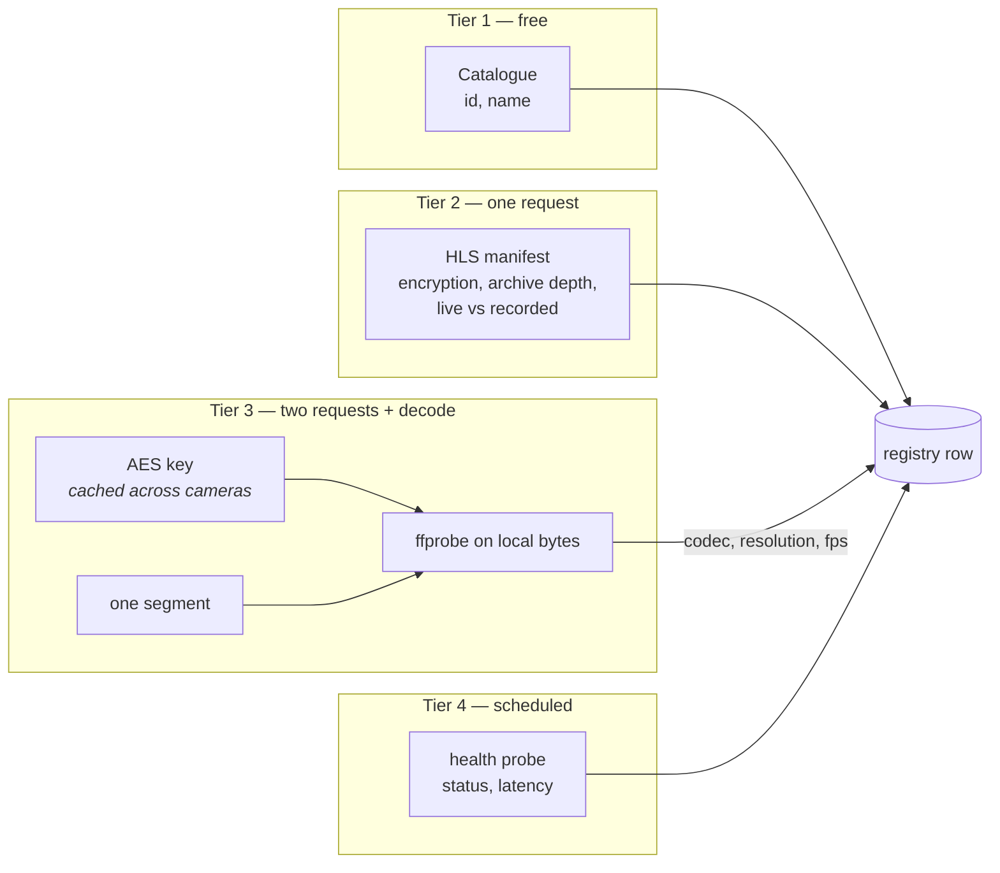
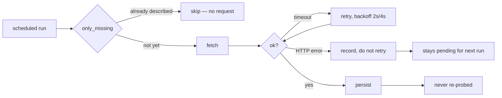
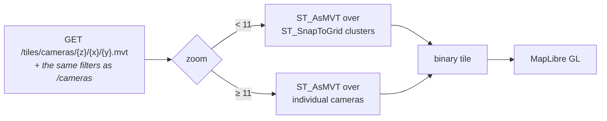
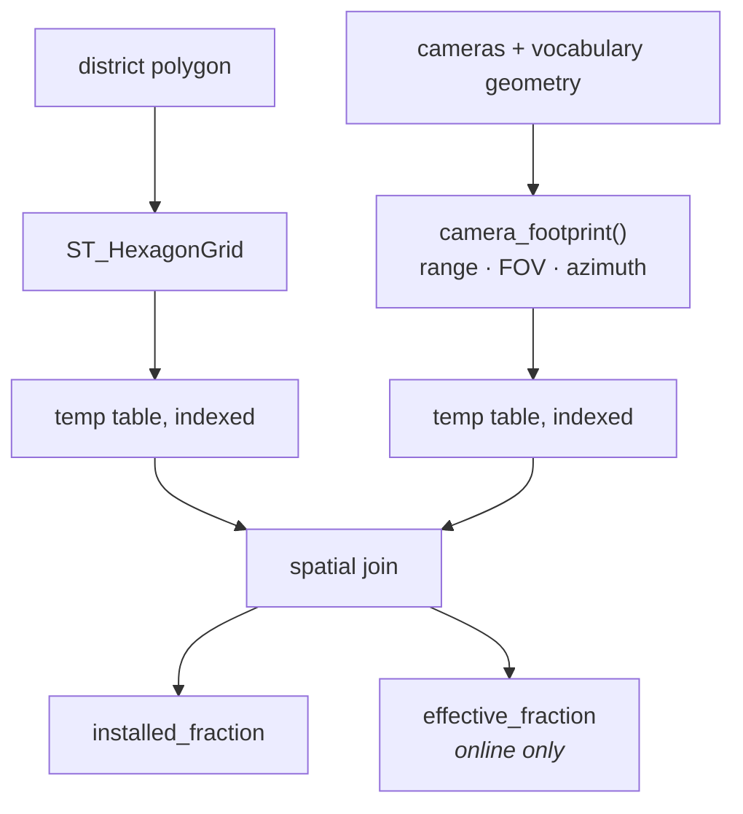
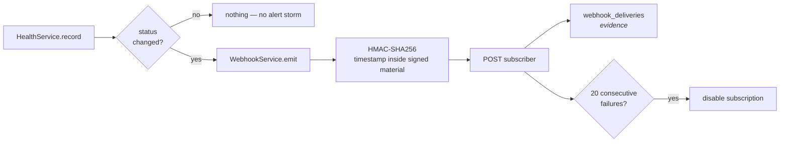
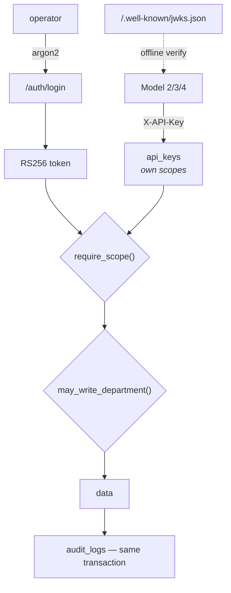

# Architecture, system design, and workflow

A map of how this system is put together and where the joints are — written so
you can find the place to change something without reading the whole codebase.

`docs/HLD.md` is the formal high-level design for submission. **This** document
is the working one: same system, but oriented around *where to optimise* and
*what will break first*.

---

## The one constraint everything follows from

> Onboarding a department nobody anticipated must not require a code change or a
> deployment.

Gujarat has 26 departments with independent CCTV systems. Nobody knows what the
27th will send. Every structural decision below is downstream of that sentence,
and if you change one, check it against this constraint first.

The consequence: **behaviour that varies by source lives in database rows, not
in Python.** There is no vendor name anywhere in the application.

| What varies | Table | Changing it is |
|---|---|---|
| A vendor's API: URL, auth, JSON shape, id keys, stream URL templates | `source_connectors.config` | an INSERT |
| A department's column names and value maps | `field_mappings.config` | an INSERT |
| Camera types, statuses, connectivity, site types | `vocabulary_terms` | an INSERT |
| Coverage geometry per camera type | columns on the `camera_type` term | an UPDATE |
| Place names the geocoder resolves | `place_aliases` | an INSERT |
| Secrets | `credentials` (by reference, env-overridable) | an INSERT |

---

## Layers

**The rule:** routers do HTTP and authorisation; services do the thinking;
repositories build queries. A router that contains business logic is a bug, and
a service that knows about `Request` is a worse one.

---

## Workflow 1 — Getting cameras in

Four entry points, **one pipeline**. This is the most important diagram here.

### Properties this buys you

- **A fix applies everywhere.** The CSV encoding fix also fixed the connector path.
- **`validate_only` runs the whole real pipeline** and writes nothing. The preview
  wizard is not a second, simpler code path — that is why the preview cannot lie.
- **Idempotent** on `(department_id, external_camera_id)`. A nightly sync reports
  `skipped` and writes nothing.
- **One bad row fails alone.** Its batch-mates still commit.

### Where to change things

| You want to… | Touch |
|---|---|
| Accept a new file format (XLSX, JSON) | new adapter in `app/adapters/`, produce `RawCameraRecord` |
| Change how a column maps | a `field_mappings` row — no code |
| Add a camera type | a `vocabulary_terms` row — no code |
| Change validation rules | `app/services/validation.py` |
| Change dedupe identity | `app/services/ingestion.py` — **read the whole file first**, idempotency depends on it |

### The sharp edge here

`_sync_endpoints` **replaces** a camera's endpoints on every sync, because the
source is authoritative about how a camera can be reached. But it now *carries
forward* fields the source never supplies — `codec`, `resolution`, `verified_at`,
`last_probe_status` — matched on `(protocol, url)`.

That distinction is load-bearing. Without it, every nightly sync silently wiped
everything enrichment had measured, and against a gateway that answers in ~11
seconds the registry could never converge. If you touch this function, keep the
rule: **the source wins where it speaks; what we measured stands where it is
silent.**

---

## Workflow 2 — Filling in what sources do not send

The organisers' sandbox returns `{"id", "name"}` and nothing else. This is
normal, so the registry derives the rest.

### The performance shape — read this before optimising

Measured against the live sandbox:

| Operation | Cost | Bottleneck |
|---|---|---|
| Gateway request, any size | **~11s cold, worse under load** | **the gateway** |
| Manifest (216 KB, 7,200 entries) | 1 request | gateway |
| Key (16 bytes) | 1 request, **cached** | gateway |
| Segment (268 KB) | 1 request | gateway |
| ffprobe on local bytes | ~50 ms | nothing |

**The gateway is the entire cost.** ffprobe is free once the bytes are local.

This is why enrichment fetches the segment itself instead of handing ffprobe a
playlist URL: that made ffmpeg do three serial round-trips it controlled and we
could not bound — ~29 seconds for one camera, unloaded. Now it is two requests,
one of them cached away after the first camera.

**Do not optimise the decoder. Optimise the number of gateway requests.**

### Robustness strategy for a dependency we do not control

Four properties, and all four matter:

1. **Convergent.** `only_missing=true` (default) skips cameras already described,
   so repeated runs close the gap instead of re-learning the same facts.
2. **Retries timeouts, not statuses.** A slow response is normal here; a 404 is a
   settled fact and re-asking wastes the bottleneck.
3. **Never destructive.** A failed probe leaves the previous values alone.
4. **Durable partway through.** Commits happen every `ENRICH_CHUNK` cameras, not
   once at the end. A pass runs for minutes; a single trailing commit meant an
   interrupted run — a restart, a timeout, a dropped connection — threw away
   everything it had already measured, so the registry never converged no matter
   how many times it was run.

Two budgets, deliberately different: `media_timeout` (45s) bounds one *network*
fetch, `decode_timeout` (15s) bounds ffprobe reading bytes already in memory.
Sharing one 90s budget made the worst case 276s per camera and a fleet pass could
not finish.

**Consequence for operations:** full enrichment of a fleet behind a slow gateway
is a *scheduled job that converges over several passes*, not a request anybody
waits on. Design around that rather than fighting it.

---

## Workflow 3 — Serving the map at scale

80,000 markers cannot go to a browser as GeoJSON.

The tile endpoint and the list endpoint resolve **the same FastAPI dependency**
(`camera_filter`). That is why the map and the table cannot disagree — one query
shape, not two. If you add a filter, add it there and both get it.

**Optimisation headroom, in order:** the MVT queries are the hot path; index
coverage on `cameras(department_id, camera_type, current_status)` and the GIST
index on `location` are what keep them fast. Coverage tiles are immutable per run
and cache for 24h including empty ones. Next step at real scale is read replicas
for tile serving.

---

## Workflow 4 — Coverage analysis

Bhavnagar, 46k cells: **6.0 seconds**. This was 142 seconds before the join moved
onto indexed temp tables — if you touch `app/services/coverage.py`, benchmark it.

Guard rail: `CoverageTooLargeError` above 250,000 cells, rather than exhausting
memory.

---

## Workflow 5 — Alerts and preview

Both talk outward, and both are deliberately bounded.

**Alerts fire on transition only.** Per-observation would alert every five minutes
for as long as a camera is down, which trains operators to ignore the channel.

Delivery **never** raises and never rolls back the observation that caused it.

### The preview proxy — the only caller-controlled fetch

`/cameras/{id}/preview.m3u8` exists because the gateway sends no CORS headers and
its cookie is `HttpOnly; SameSite=Lax` — a browser physically cannot play the
stream directly.

**This is the highest-risk surface in the system**, because `target` comes from
the browser. It is confined to the camera's own scheme+host+port. If you change
`app/services/stream_proxy.py`, the SSRF tests in
`tests/services/test_stream_proxy.py` are not optional.

---

## Security model

**Two independent checks on every write.** Holding `cameras:write` is not enough;
`may_write_department()` confirms the principal may write to *that* department.
Scope alone would let a municipal admin write to Police — that was a real bug,
found and fixed, and it is why both checks exist on all write paths.

RS256 rather than HS256 so Models 2–4 verify tokens offline: their login must not
fail because this service is restarting.

---

## Where this will break first

Honest list, worst first.

| Risk | Why | Mitigation today | Next step |
|---|---|---|---|
| **External gateway latency** | ~11s/request, degrades under load; entirely outside our control | convergent runs, key cache, retry/backoff, bounded concurrency | partition workers by department, stagger schedules |
| **Session credential expiry** | a stale cookie makes every probe look like an outage | redirects recorded as `unknown`, never `offline` | automated re-login per connector |
| **Coverage at state scale** | cell count grows quadratically with area/edge² | hard cap at 250k cells | precompute per district overnight |
| **Single Postgres** | tiles, coverage and writes share one instance | indexed, bounded queries | read replicas for tiles |
| **No webhook retry** | a subscriber down for a minute misses the event | documented explicitly; deliveries logged | durable queue if anyone needs at-least-once |
| **`metadata` JSONB growth** | unmapped values accumulate | vocabulary terms reduce it over time | prune once mappings stabilise |

---

## Testing model

**642 tests.** The ones that matter most are not the happy paths:

| Area | Count | What they actually guard |
|---|---|---|
| Connectors + onboarding | 262 | every source shape, encoding, delimiter, auth scheme, failure mode |
| Stream proxy | 33 | SSRF containment — the caller-controlled fetch |
| Webhooks | 53 | signing, replay, isolation, auto-disable |
| Docs | 14 | every documented endpoint exists in the published spec |

These found **17 real defects**, including government-Excel encodings that
crashed imports before a row was read, a coverage tile route with no
authentication, and the sync that wiped derived metadata.

`TEST_DATABASE_URL` overrides the testcontainer for CI or a loaded machine.

---

## If you change one thing, read this first

| Changing | Read first | Because |
|---|---|---|
| `ingestion.py` | the whole file | idempotency and the derived-field carry-forward both live here |
| `stream_proxy.py` | its test file | SSRF containment |
| `coverage.py` | the 6s benchmark | it was 142s once |
| `_sync_endpoints` | the docstring | it silently destroyed metadata for a week |
| anything in `services/` | the router that calls it | authorisation lives in the router, not here |
| a vocabulary/connector/mapping | nothing — it is a row | that is the whole point |
