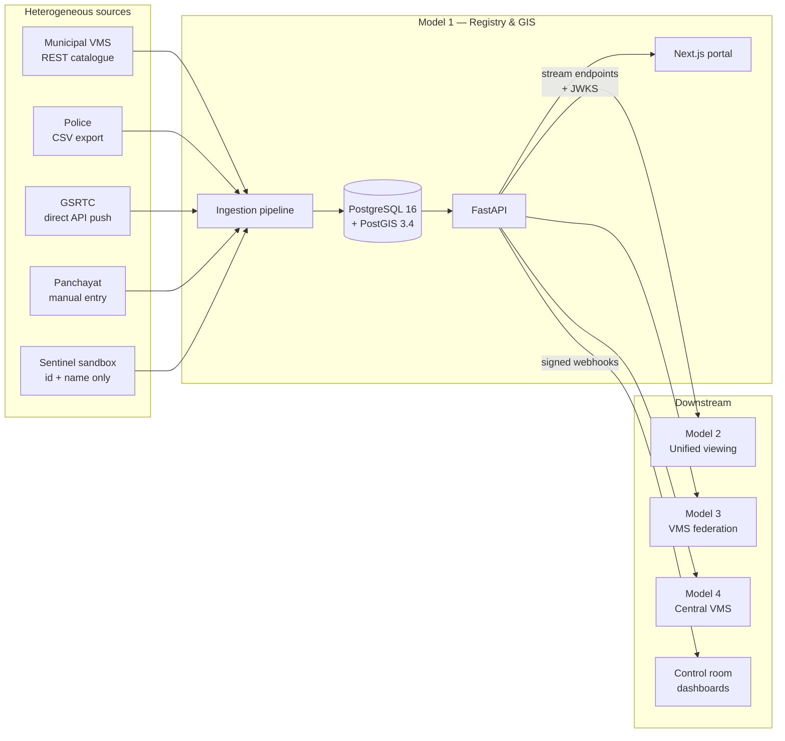
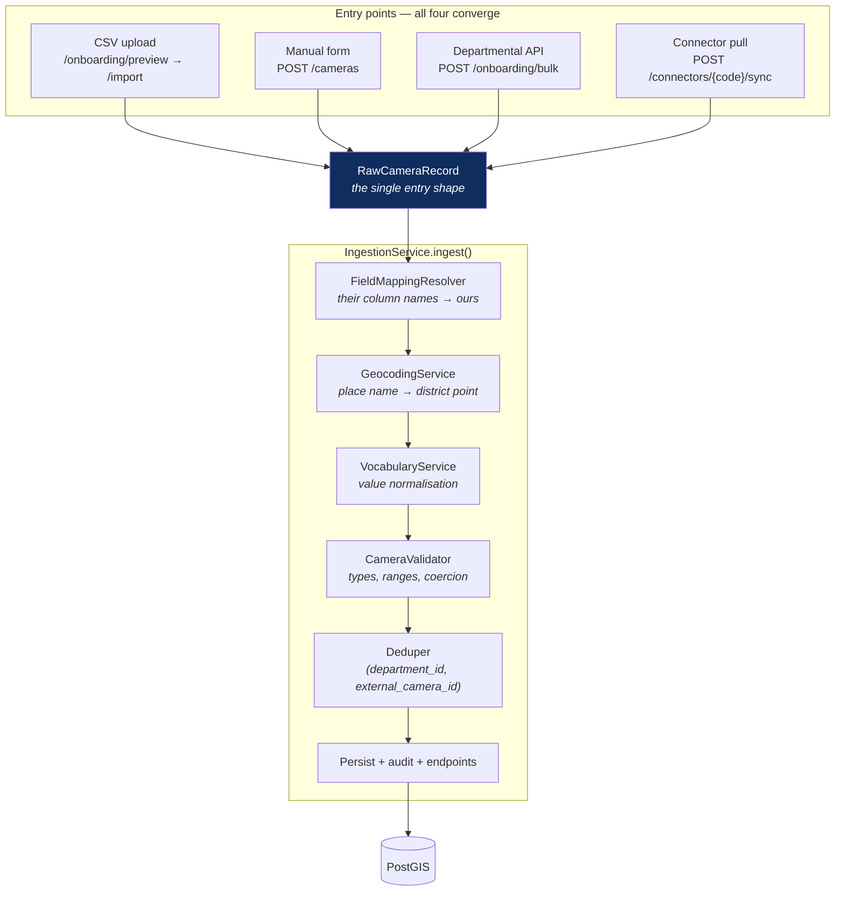
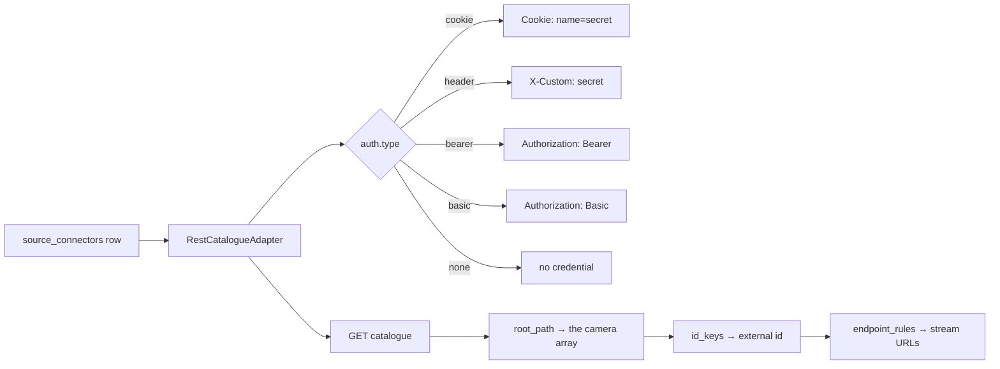
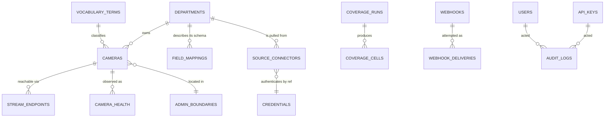
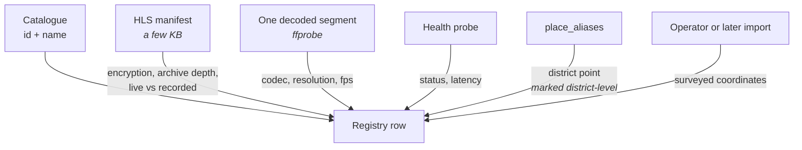
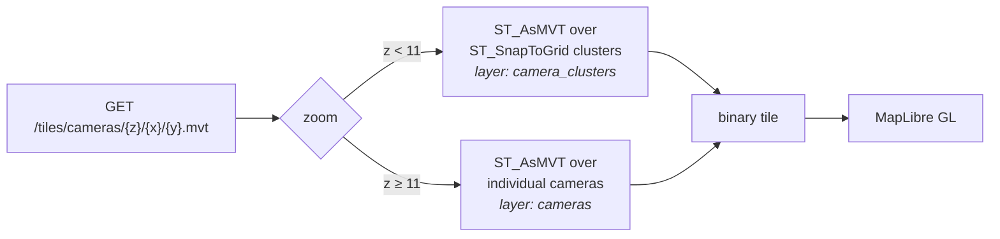
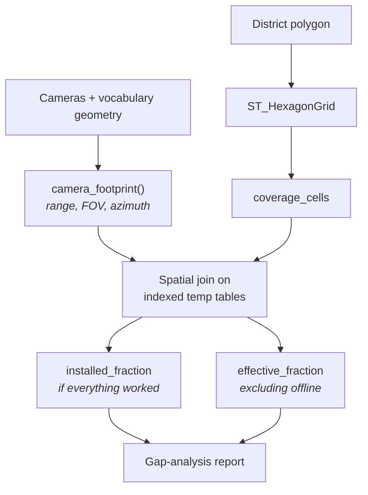
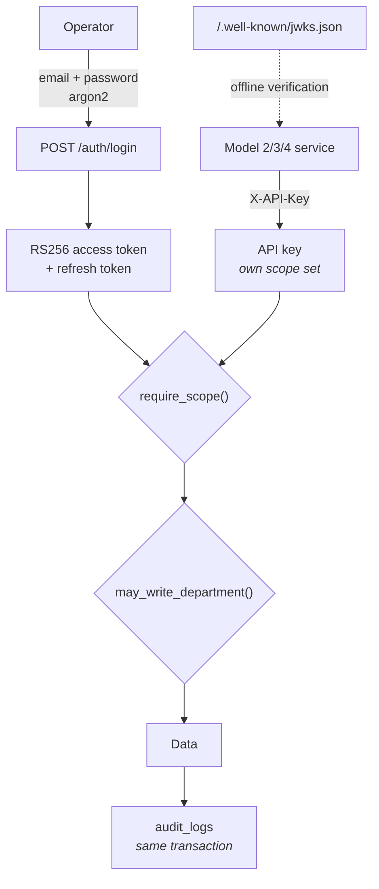

# High-Level Design — Model 1

**Centralised CCTV Registry & GIS Foundation**
Gujarat Police Innovation Challenge 2026 · Sentinel Gujarat

---

## 1. The problem, stated precisely

Twenty-six government departments run independent CCTV systems. There is no
single answer to "how many cameras does the state have, where are they, and
which of them work right now" — and every other model in this challenge needs
that answer before it can begin.

The difficulty is not scale. Eighty thousand rows is a small database. The
difficulty is that **no two departments describe a camera the same way**, and the
state cannot compel them to change their systems before this one is useful.

So the central design constraint is:

> Onboarding a department nobody anticipated must not require a code change or a
> deployment.

Everything below follows from that.

---

## 2. System context



Model 1 owns **metadata and asset visibility only**. No video passes through it.
It tells other systems how to reach a camera; it never proxies the stream.

---

## 3. Component architecture



**One pipeline, four doors.** A bug fixed for CSV upload is fixed for the vendor
sync, because there is only one implementation. `validate_only` runs the entire
pipeline and writes nothing, which is what makes the preview wizard possible
without a second code path.

---

## 4. Configuration, not code

This is the load-bearing idea. Nothing below is a Python class:

| What varies by source | Where it lives | Changing it is |
|---|---|---|
| Catalogue URL, auth scheme, JSON shape, id keys, stream protocols | `source_connectors.config` | an INSERT |
| A department's column names and value maps | `field_mappings.config` | an INSERT |
| Camera types, statuses, connectivity, site types | `vocabulary_terms` | an INSERT |
| Coverage geometry per camera type | columns on the `camera_type` term | an UPDATE |
| Place names the geocoder resolves | `place_aliases` | an INSERT |
| Secrets | `credentials`, by reference, env-overridable | an INSERT |



`RestCatalogueAdapter` contains no vendor name. It does not know that "sentinel"
exists, nor that HLS or RTSP exist. Onboarding a 27th department is a row.

---

## 5. Data model



Seventeen tables, ten migrations. Geography columns are `geography(Point,4326)`
so distance predicates are metres without projection maths.

**Identity.** A camera is unique on `(department_id, external_camera_id)`. That
composite is what makes every ingestion path idempotent: re-running a nightly
sync produces `skipped`, writes nothing, and adds no audit rows.

**Provenance.** `camera_uid` (`GJ-POL-000123`) is the registry's own stable
identifier, minted per department. Downstream systems key on it, so a department
renumbering its internal ids does not orphan anything.

---

## 6. Deriving what sources do not send

The organisers' own sandbox returns two fields per camera — `id` and `name`. It
is not unusual. So the registry asks the camera rather than the catalogue:



Each tier is independent — a camera that fails one still gets the others — and
**a failed probe never erases what a successful one established**.

Position precision is recorded, never implied. A camera placed from its name
carries `geocode_precision: "district"`, and the map, the detail page and every
coverage report say so rather than presenting a district centroid as a survey.

---

## 7. GIS design

Eighty thousand markers cannot be sent to a browser as GeoJSON. The map is served
as **Mapbox Vector Tiles generated inside PostGIS**:



The tile endpoint takes **the same filter parameters as `GET /cameras`**, resolved
by the same FastAPI dependency. The markers on the map and the count in the table
therefore cannot disagree — they are one query shape, not two.

Coverage is a second tile layer over `coverage_cells`, selectable as an overlay.
A completed run is immutable, so its tiles cache for a day.

### Coverage computation



The gap between the two figures is the finding: coverage lost to **broken**
equipment rather than **absent** equipment. Those have very different budgets.
Footprint geometry comes from `vocabulary_terms`, so a department that knows its
PTZ units reach 400m edits a row.

---

## 8. Security



- **RS256, not HS256.** The public key is published at
  `/.well-known/jwks.json`, so Models 2–4 verify our tokens offline. Their login
  does not fail because this service is restarting.
- **Two independent checks on every write.** Holding `cameras:write` is not
  enough — `may_write_department()` confirms the principal may write to *that*
  department. Scope alone would let a municipal admin write to Police.
- **Secrets are never in configuration.** Connectors and webhooks name a
  `credential_ref`; the value lives in `credentials` and is overridable by
  environment variable, so rotating a production secret does not require a
  database write.
- **Audit in the same transaction as the change**, so the trail cannot record
  something that was rolled back. Nothing is written for a no-op.
- **Outbound payloads are HMAC-signed** with the timestamp inside the signed
  material, so a captured delivery cannot be replayed.

---

## 9. Integration methodology for Models 2–4

The contract another team codes against:

```python
import httpx, jwt

# 1. Verify our tokens offline.
jwks = httpx.get("https://<registry>/.well-known/jwks.json").json()
key = jwt.PyJWK.from_dict(jwks["keys"][0]).key
claims = jwt.decode(token, key, algorithms=["RS256"], audience="sentinel-platform")

# 2. Find cameras — the same filters the map uses.
cameras = httpx.get(
    "https://<registry>/api/v1/cameras",
    params={"district": "Rajkot", "status": "online", "limit": 500},
    headers={"X-API-Key": key},
).json()

# 3. Get a reachable stream for one.
streams = httpx.get(
    f"https://<registry>/api/v1/cameras/{camera_id}/streams",
    headers={"X-API-Key": key},
).json()
# Prefer by reachability: public_cdn works anywhere; direct_ip needs ports open.
```

Plus **push**, so nobody polls:

```
POST /api/v1/webhooks   { "events": ["camera.offline"], "secret_ref": "..." }
```

Delivery never affects the registry: a camera going offline is recorded whether
or not anyone could be told. There is no automatic retry — the webhook is a
low-latency hint, and `GET /cameras?status=offline` remains the source of truth
to reconcile against.

---

## 10. Scalability

| Concern | Approach | Measured |
|---|---|---|
| 80k cameras on a map | MVT generated in PostGIS, clustered below z11 | renders at state zoom |
| Coverage over a district | Spatial join on indexed temp tables | 6.0s for Bhavnagar (46k cells) |
| Fleet-wide health probing | Bounded concurrency, least-recently-checked first, rotates fairly | 200/batch, 20 concurrent |
| Stream enrichment | Bounded to 4 concurrent; ~16s/camera | scheduled, not interactive |
| Coverage tiles | Immutable per run, cached 24h including empty tiles | — |

Known limits, stated rather than hidden: coverage refuses runs above 250,000
cells with `CoverageTooLargeError` instead of exhausting memory; enrichment is an
overnight job at fleet scale, not a button.

### Path to production

Nothing here needs redesigning to scale — the next steps are operational: a
worker pool partitioned by department with staggered schedules, read replicas for
tile serving, and PMTiles for an offline basemap in a control room without
internet.

---

## 11. Verification

**622 automated tests**, including 262 on the connector and onboarding paths
alone. These are not smoke tests: they found fourteen real defects, among them
government-Excel encodings (`cp1252`, UTF-16) that crashed imports before a row
was read, semicolon-delimited files that parsed as a single unusable column, and
a coverage tile route that required no authentication at all.

**Verified against the organisers' live sandbox**, not a mock:

| | |
|---|---|
| Catalogue onboarded | 30 of 30 entries, across 10 districts |
| Re-sync | creates nothing; idempotent |
| Metadata derived | 30 of 30 cameras: h264, five distinct resolutions from 854×480 to 1920×1080, frame rates 10–30fps |
| Streams | AES-128 encrypted, `PLAYLIST-TYPE:VOD` (recorded loops, not live) |
| Step 4 test case | 50 heterogeneous cameras onboarded, re-run writes nothing |

The documentation is drift-tested: every `/api/v1` path named in a public
document must resolve to a route in the published OpenAPI spec, or the build
fails.
